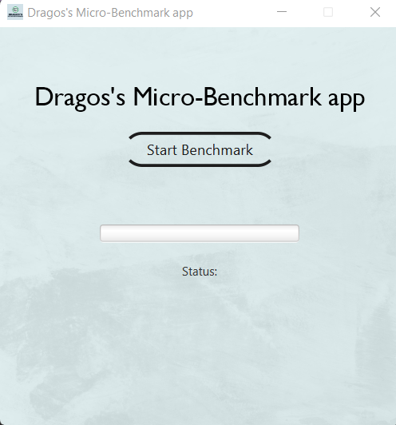
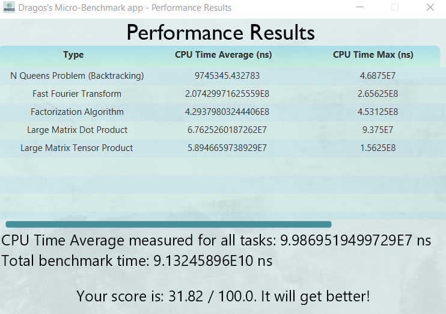
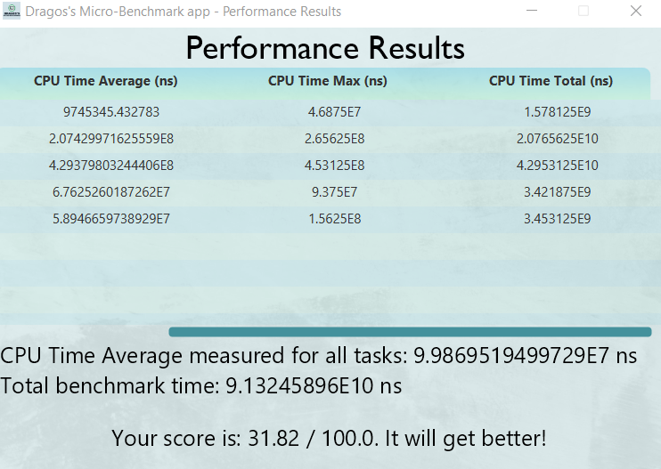

# micro-benchmark

<p align="center">
  
</p>

Java program that measures the CPU Time of a computer by performing several tests and calculating a score. Small project made during my second year of Computer Engineering studies at Polytechnic University of Timișoara. Technologies used:
* [Java 17](https://www.oracle.com/java/technologies/javase-downloads.html)
* [JavaFX 18](https://openjfx.io/openjfx-docs/) (as GUI)
* [Maven](https://maven.apache.org/) (build tool)
* [Google Firebase](https://firebase.google.com/) (as Database, for calculation of user score)

## Prerequisites
To be able to install and run this project, please make sure you have installed Java 17 or higher. Otherwise, the setup will not work!
To check your Java version, please run `java -version` in the command line.

To install a newer version of Java, you can go to [Oracle](https://www.oracle.com/java/technologies/javase-downloads.html) or [OpenJDK](https://jdk.java.net/).

It would be good if you also installed Maven to your system. To check if you have Maven installed run `mvn -version`.

If you need to install any of them, please refer to this [Maven tutorial](https://www.baeldung.com/install-maven-on-windows-linux-mac).

Make sure you install JavaFX SDK on your machine, using the instructions provided in the [Official Documentation](https://openjfx.io/openjfx-docs/#install-javafx). Make sure to export the `PATH_TO_FX` environment variable, or to replace it in every command you will find in this documentation from now on, with the `path/to/javafx-sdk-18/lib`.

## How to build
To set up and run the project locally on your machine, please follow the next steps.

### Clone the repository
Clone the repository using:
```git
git clone https://github.com/efrem-upt/micro-benchmark
```

### Verify that the project Builds locally
Open a command line session and `cd micro-benchmark`.
If you have installed all the prerequisites, you should be able to run any of the following commands:
```
mvn clean install
```
If you prefer to run using the wrappers, you could also build the project using 
```
./mvnw clean install (for Linux or MacOS)
or 
mvnw.cmd clean install (for Windows)
```

### Create the database format

1. Visit `https://console.firebase.google.com/` and create a new Firebase project
2. Head over to the `Firestore Database` section of your project
3. Press the `Start Collection` button and name the collection `results`
4. For `Document ID`, type `results-document`
5. Create the field `cpuTimeAverage` and set the type equal to `array`
6. Press the `Save` button

### Generate the serviceAccountKey.json file

This file is required for the implementation of user scores via Google Firebase.

1. Head over to `Project Settings` and then to `Service accounts`
2. Press the `Generate new private key` button and then `Generate key`
3. Rename the file to `serviceAccountKey.json` and place it in the Resources folder

### Run the app

To start and run the project use one of the following commands:
* `mvn javafx:run` or `./mvnw javafx:run` (run the `run` goal of the `javafx` maven plugin)

To understand better how to set up a project using JavaFX and [Maven](https://openjfx.io/openjfx-docs/#maven), please check the [official OpenJFX documentation](https://openjfx.io/).

## How it works

The user shall be presented with the following screen: 

<p align="center">
  
</p>

Pressing on the `Start Benchmark` button will start the benchmark and do five tests: `N Queens Problem (Backtracking)`, `Fast Fourier Transform`, `Factorization Algorithm`, `Large Matrix Dot Product`, `Large Matrix Tensor Product`. More tests can be added by following the same procedures as the first five.

When the tests are completed, the user's general peformance (`CPU Time Average measured for all tasks`) are sent to a Google Firebase database. This is in order to calculate how "good" the PC is based on other PC's performances that ran the same program.

*Note: Averages are geometric. This also includes `CPU Time Average measured for all tasks`. This one is calculated using the `Weighted Geometric Average`. Each test has been given the following weights:*
 - `N Queens Problem (Backtracking)`: 0.05% per test, 100 tests runned;
 - `Fast Fourier Transform`: 0.25% per test, 100 tests runned;
 - `Factorization Algorithm`: 0.3% per test, 100 tests runned;
 - `Large Matrix Dot Product`: 0.5% per test, 50 tests runned;
 - `Large Matrix Tensor Product`: 0.3% per test, 50 tests runned;

*This is so the score can be a weighted score. Being weighted, `CPU Time Average measured for al tasks`'s meaning is based on the meaning of the weights. They have been chosen such that more demanding tests are worth more than easier tests.*

*Note 2: For the CPU Time calculation the getThreadCpuTime method from the java.lang.management.ThreadMXBean class has been used. It measures CPU Time on a given thread by a certain id, so every time the test is run, it had to be put in its thread, and save the CPU Times calculated for each iteration in a list to be manipulated later statistically. Basically, several synchronization operations between threads had to be performed to achieve all the functionalities of the application.*
## Features

- Calculates three versions of CPU Time for each test: `CPU Time Average`, `CPU Time Max`, `CPU Time Total`. Data is presented in a table at the end of the process.
- Integrated with Google Firebase for keeping track of users overall score via `CPU Time Average measured for all tasks`.
- Shows a score of how good the PC is doing against other computers that ran the program (via Firebase array fetching and position of user in the array).
- Optional internet connection. Internet connection is only required for scoring purposes. The score will not be shown for users with no internet connection. However, the main results of the application are available.

## Demo

<p align="center">
  
</p>

## Screenshots

<p align="center">
  
</p>
<p align="center">
  
</p>


## License

[MIT](https://choosealicense.com/licenses/mit/)

